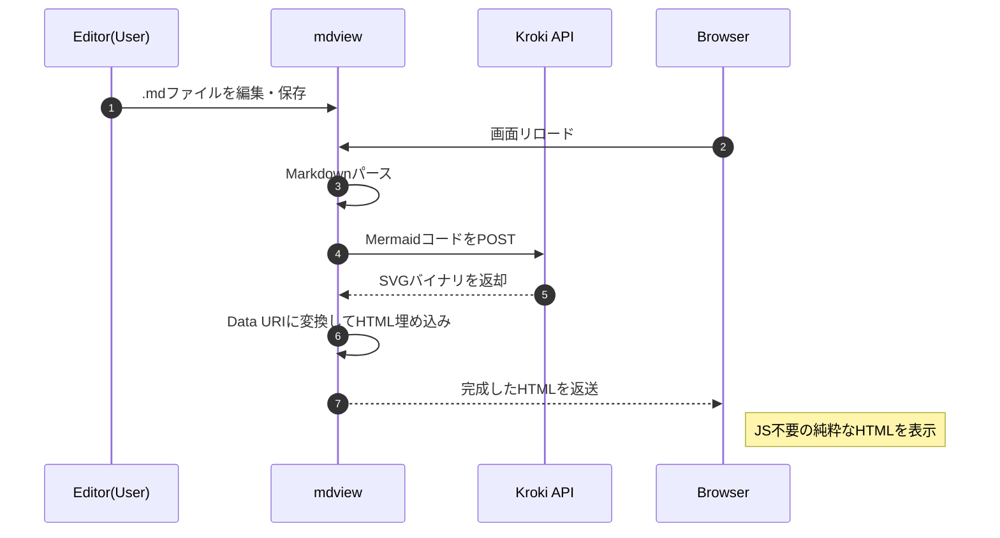

# mdview

go の勉強も兼ねて .md ファイルを .html に変換して返す簡易HTTPサーバを作る

## ビルド

```bash
$ make build
```

## 起動方法

以下のように起動して `http://mdview_addresss:18080/` のようにアクセスするとファイル一覧が表示されるので表示したいファイルをクリック

```bash
$ ./mdview
```

### 起動時パラメータ

- 環境変数 MD_DOC_ROOT: ドキュメントルートを設定  
	以下のようにすることで、別ディレクトリ以下のファイルを閲覧可能(絶対パスでも相対パスでもOK)
```bash
$ MD_DOC_ROOT=../other_program ./mdview
```

## シーケンス図
早速コードブロック `mermaid` を使ってみる



## Change Log
- 2026.01.30
	- kroki API へのアクセスは POST 方式にした
	- キャッシュを導入して API へのアクセス回数低減を図るとともに、表示速度向上
- 2026.01.29
	コードブロック `mermaid` に対応した
