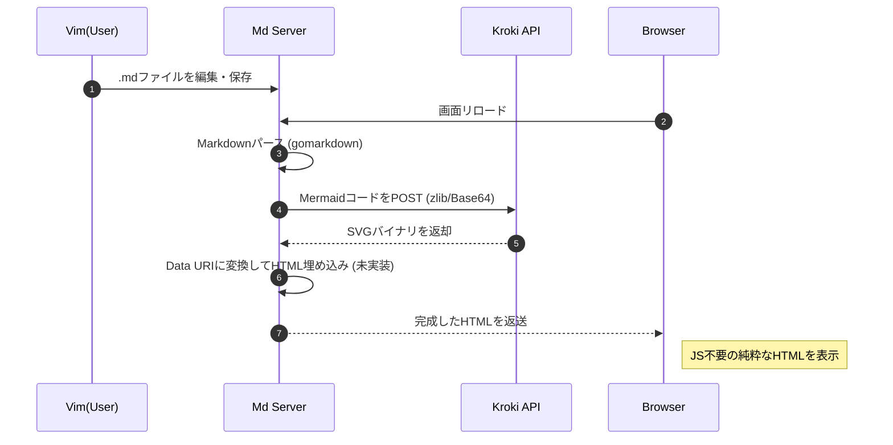
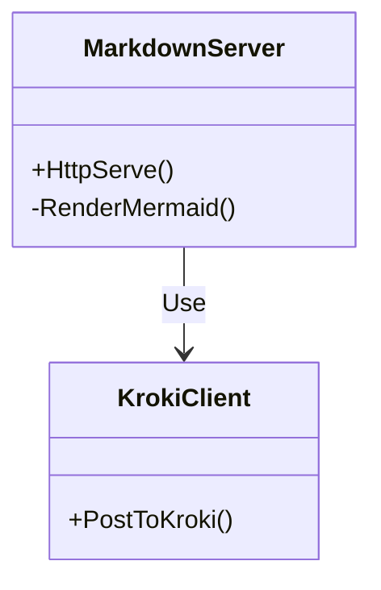

# md_server

go の勉強も兼ねて .md ファイルを .html に変換して返す簡易HTTPサーバを作る

### シーケンス図
早速コードブロック `mermaid` を使ってみる

```mermaid
sequenceDiagram
    autonumber
    participant V as Vim(User)
    participant S as Md Server
    participant K as Kroki API
    participant B as Browser

    V->>S: .mdファイルを編集・保存
    B->>S: 画面リロード
    S->>S: Markdownパース (gomarkdown)
    S->>K: MermaidコードをPOST (zlib/Base64)
    K-->>S: SVGバイナリを返却
    S->>S: Data URIに変換してHTML埋め込み (未実装)
    S-->>B: 完成したHTMLを返送
    Note right of B: JS不要の純粋なHTMLを表示
```

### クラス図

```mermaid
classDiagram
    class MarkdownServer {
        +HttpServe()
        -RenderMermaid()
    }
    class KrokiClient {
        +PostToKroki()
    }
    MarkdownServer --> KrokiClient : Use
```

## Change Log
- 2026.01.29
	コードブロック `mermaid` に対応した
