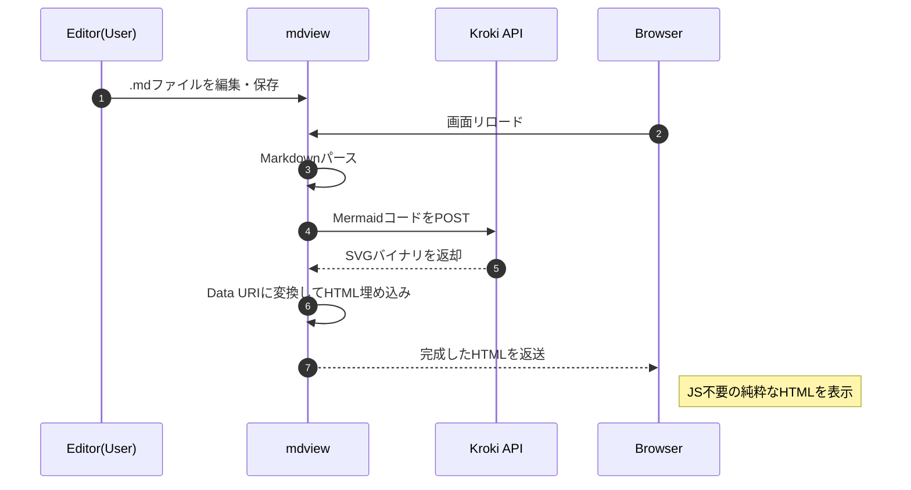

# mdview

go の勉強も兼ねて .md ファイルを html に変換して返す簡易HTTPサーバを作る

## どういう時に使うと便利か

- markdown ファイルが手元のPC以外の場所にある
- samba 等で直接ファイルを参照できない

## 例えばこんな時に使うと便利かも？

- 自分が操作するPCは Windows
- markdown ファイルがあるのは Linux
- putty/wezterm/wt.exe 等の Windows アプリから Linux にログイン
- Linux 上で vim 等のテキストエディタで markdown ファイルを編集
- 編集中の markdown ファイルをプレビューしたいけど、ファイルをいちいち転送するなんてメンドクサイことしたくない
- samba も設定するのが面倒（もしくはsambaを用意することができない）

##### VSCode 使えば？
うん...
人には拘りたいことの一つや二つあるものさ

# ビルド

```bash
$ make build
```

# 起動方法

以下のように起動して `http://mdview_addresss:port/` のようにアクセスするとファイル一覧が表示されるので表示したいファイルをクリック

```bash
$ ./mdview
```

表示されたらあとは markdown ファイルの編集をして、保存したらブラウザをリロード  
マウスレス生活が送れます

## 環境変数

### MDVIEW_DOC_ROOT

ドキュメントルートを設定  
以下のようにすることで、別ディレクトリ以下のファイルを閲覧可能(絶対パスでも相対パスでもOK)  
未指定の場合はカレントディレクトリがドキュメントルートになる
```bash
$ MDVIEW_DOC_ROOT=../other_program ./mdview
```

### MDVIEW_PORT

listen するポート番号  
未指定の場合はデフォルトの `18080`
```bash
$ MDVIEW_PORT=9999 ./mdview
```

### 両方指定可能（そりゃそう）
```bash
$ MDVIEW_PORT=12345 MDVIEW_DOC_ROOT=$HOME/doc ./mdview
```

もしくは
```bash
$ export MDVIEW_PORT=12345
$ export MDVIEW_DOC_ROOT=../../../../tmp/doc
$ ./mdview
```

# シーケンス図
早速コードブロック `mermaid` を使ってみる



## Change Log
- 2026.01.30
	- kroki API へのアクセスは POST 方式にした
	- キャッシュを導入して API へのアクセス回数低減を図るとともに、表示速度向上
	- 環境変数名の prefix を MDVIEW で統一
	- ポートを指定できるように
- 2026.01.29
	コードブロック `mermaid` に対応した
